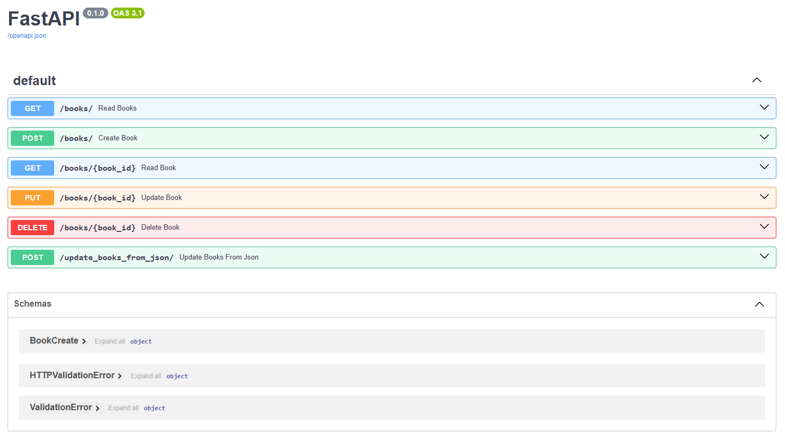
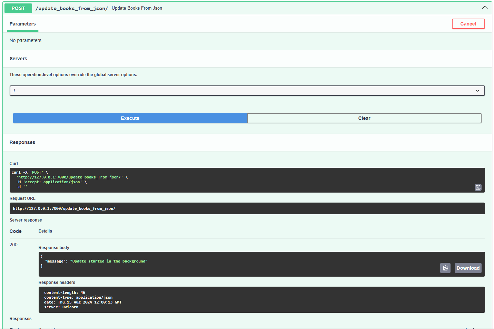

# Библиотека книг на Fast API


## Описание web-приложения:
**BookStore API** - это простое и элегантное веб-приложение, разработанное с использованием FastAPI, предназначенное для управления коллекцией книг.
API предоставляет удобные интерфейсы для взаимодействия с библиотекой книг, позволяя пользователям просматривать, добавлять, обновлять и удалять книги из коллекции.

### 🖥️ Основные возможности:
**1️⃣ Получение списка всех книг:** Вы можете получить полный список книг в библиотеке.

**2️⃣ Просмотр информации о книге по ID:** Возможность получить детальную информацию о конкретной книге по её уникальному идентификатору.

**3️⃣ Добавление новой книги:** Позволяет добавлять новые книги в библиотеку.

**4️⃣ Обновление информации о книге:** Обновление данных существующей книги.

**5️⃣ Удаление книги:** Удаление книги из библиотеки по её идентификатору.

**6️⃣ Загрузка и обновление данных в бд:** Обновление актуальных данных из файла books.json.





### 🛠 Стек технологий:
**FastAPI** – быстрый и современный веб-фреймворк для создания API на Python.

**Pydantic** – для валидации данных и определения моделей данных.

**SQLAlchemy** - для создания и работы с базой данных.

**JSON** – используется для хранения данных о книгах.

### 📖 Структура проекта:
```
books_app/
│
├── data/
│   └── books.json   ⬅️ словарь с книгами
│
├── main.py          ⬅️ основной файл web-проекта
├── models.py        ⬅️ модели базы данных SQLAlchemy
├── load_books.py    ⬅️ загрузка данных в базу данных
├── books.db         ⬅️ база данных web-приложения
├── library.png      ⬅️ главная фотография репозитория
├── requirements.txt ⬅️ установка необходимых библиотек
├── .gitignore       ⬅️ файл для игнорируемых файлов и папок в git
└── README.md        ⬅️ описание проекта
```

### Запуск проекта:
**cmd:** uvicorn main:app --reload

Если не работает на 8000 порту, то можно запустить на 8080 или 7000:

**cmd:** python -m uvicorn main:app --port 8080

**cmd:** python -m uvicorn main:app --port 7000

### Установка зависимостей:
**cmd:** pip install fastapi uvicorn sqlalchemy sqlite3

### Взаимодействие с API:
**A) Получить список всех книг:** GET /books/

**B) Получить информацию о книге по ID:** GET /books/{book_id}

**C) Добавить новую книгу:** POST /books/

**D) Обновить информацию о книге:** PUT /books/{book_id}

**E) Удалить книгу:** DELETE /books/{book_id}

**F) Обновить данные в базе данных:** POST update_books_from_json

### 🛡 Лицензия
Этот проект лицензирован под лицензией MIT. Подробности смотрите в файле LICENSE.

### 💡 Идеи для улучшений
Добавить аутентификацию и авторизацию для управления доступом к API.

Реализовать фильтрацию и поиск по различным параметрам книги.

Подключить базу данных для хранения данных о книгах вместо JSON-файла.

Разработать веб-интерфейс для удобного взаимодействия с библиотекой.

#### 💼 Автор: Дуплей Максим Игоревич
#### 📲 Telegram: @QuadD4rv1n7
#### 📅 Дата: 15.08.2024