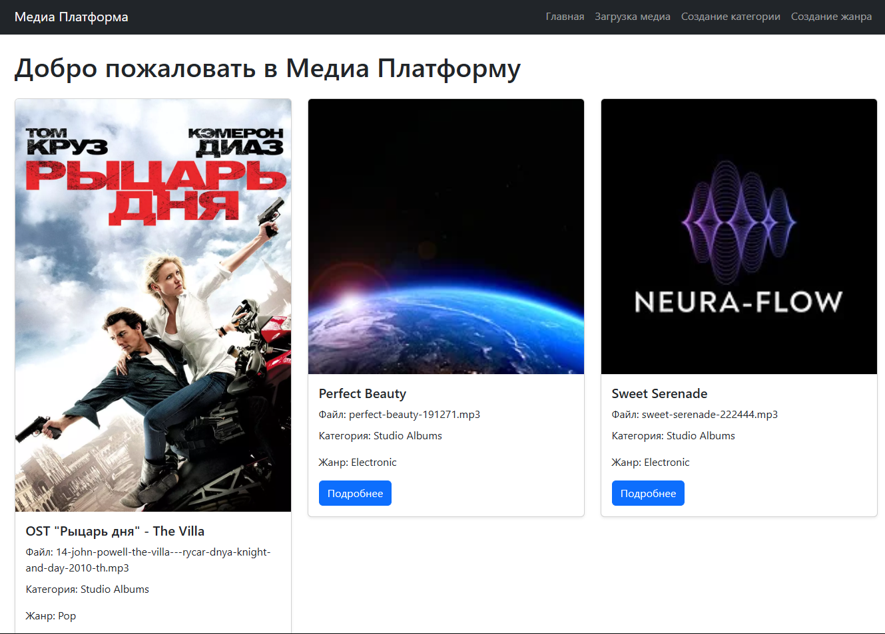
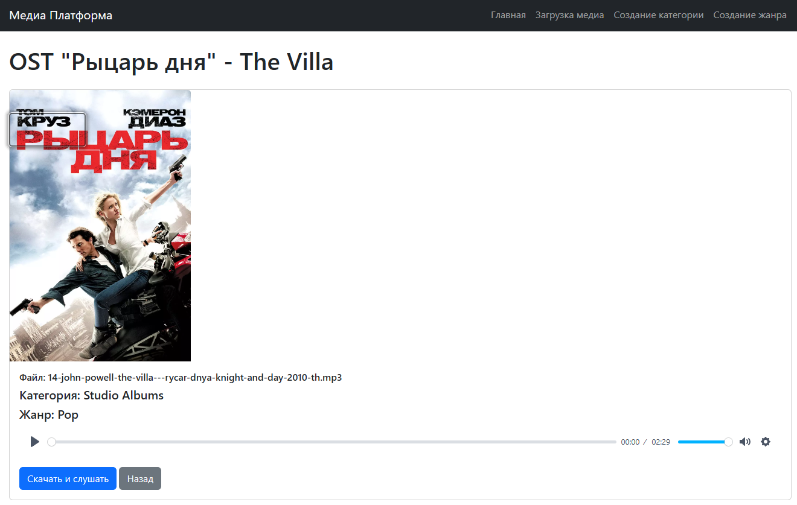
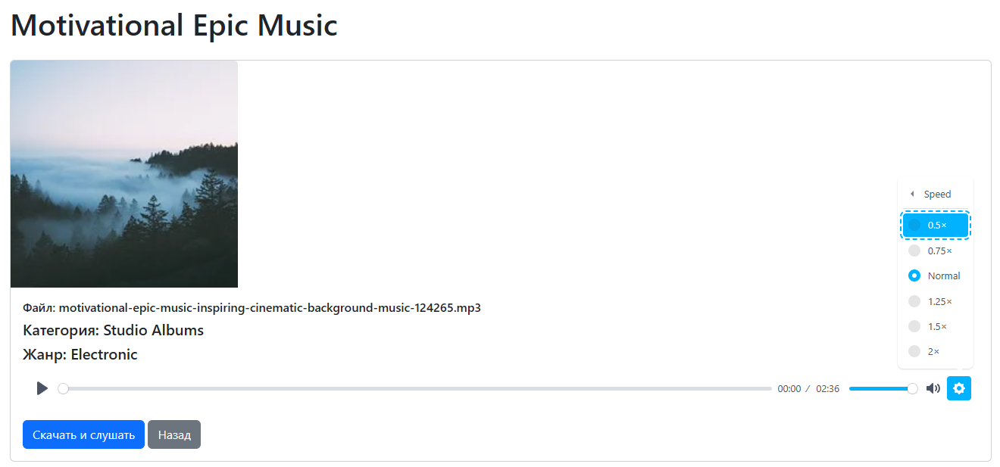

# Медиа-платформа на Fast API


## Описание web-приложения

`📺 Медиа-платформа на FastAPI` — это веб-приложение для загрузки, хранения и воспроизведения медиафайлов.

Оно позволяет пользователям загружать музыкальные файлы и обложки, а также просматривать информацию о медиафайлах, таких как категория, жанр и имя исполнителя.

Платформа использует современные технологии для обеспечения быстрого и удобного взаимодействия с пользователем.




### 🖥️ Основные возможности

`1️⃣ Загрузка медиафайлов:` Пользователи могут загружать музыкальные файлы и обложки. Поддерживается выбор категории и жанра для каждого файла.

`2️⃣ Прослушивание музыки:` Встроенный аудиоплеер позволяет прослушивать загруженные треки прямо в браузере.

`3️⃣ Просмотр информации:` На странице медиафайла отображается его название, обложка, категория и жанр.

`4️⃣ Скачивание файлов:` Предоставляется возможность скачать медиафайлы для прослушивания в оффлайн-режиме.

`5️⃣ Адаптивный дизайн:` Интерфейс приложения оптимизирован для различных устройств благодаря использованию Bootstrap.

### 🛠 Стек технологий

`FastAPI:` Современный фреймворк для создания API с высокой производительностью.

`SQLAlchemy:` ORM для взаимодействия с базой данных.

`Bootstrap:` CSS-фреймворк для создания адаптивных интерфейсов.

`Plyr:` Видеоплеер и аудиоплеер с улучшенными возможностями.

`PostgreSQL / SQLite:` Реляционная база данных (в зависимости от конфигурации).

`Jinja2:` Шаблонизатор для генерации HTML-страниц на основе данных.

### 📖 Структура проекта
```
fast_api_media_platform/
├── app/
│   ├── __init__.py
│   ├── config.py
│   ├── main.py
│   ├── crud.py
│   ├── models.py
│   ├── models_base.py
│   ├── database.py
│   └── schemas.py
│
├── static/
│   ├── css/
│   │   └── style.css
│   ├── js/
│   │   └── scripts.js
│   ├── music/
│   │   └── ... (ваша музыка)
│   ├── covers/
│   │   └── ... (ваши обложки)
│   ├── categories.json
│   └── genres.json
│
├── templates/
│   ├── index.html
│   ├── base.html
│   ├── create_category.html
│   ├── create_genre.html
│   ├── media_detail.html
│   └── upload.html
│
├── .gitignore
├── media_platform.db
├── populate_data.py
├── requirements.txt
├── alembic.ini
└── README.md
```



### Установка

**Клонируйте репозиторий:**

**cmd:** `git clone https://github.com/ваш-репозиторий.git`

### Запуск проекта

**cmd:** `uvicorn app.main:app --reload`

**Если не работает на 8000 порту, то можно запустить на 8080 или 7000:**

**cmd:** `python -m uvicorn main:app --port 8080`

**cmd:** `python -m uvicorn main:app --port 7000`

### Установка зависимостей

**cmd:** `pip install -r .\requirements.txt`

### Загрузка музыки и категорий

```
- Загрузка данных в таблицы БД: "Жанры" и "Категории"
python .\populate_data.py

- Загрузка музыки из файла musicians.json
python .\load_musicians.py
```

### 🛡 Лицензия

Этот проект лицензирован под лицензией MIT. Подробности смотрите в файле LICENSE.

### 💡 Идеи для улучшений

Добавить аутентификацию и авторизацию для управления доступом к API.

Реализовать фильтрацию и поиск по различным параметрам книги.

Подключить базу данных для хранения данных о книгах вместо JSON-файла.

Разработать веб-интерфейс для удобного взаимодействия с библиотекой.

#### **💼 Автор:** Дуплей Максим Игоревич

#### **📲 Telegram:** @quadd4rv1n7

#### **📅 Дата:** 15.08.2024
