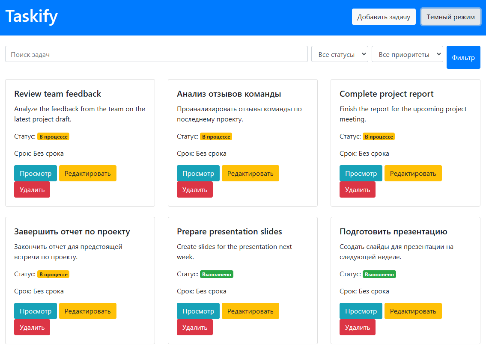
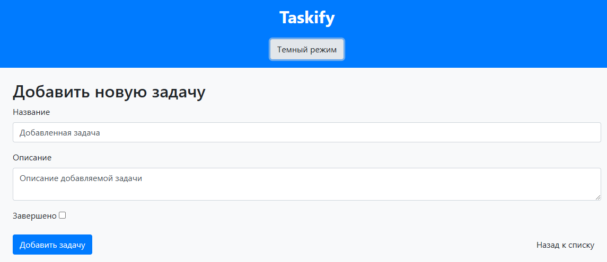
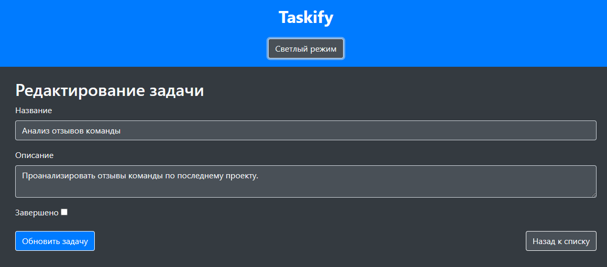
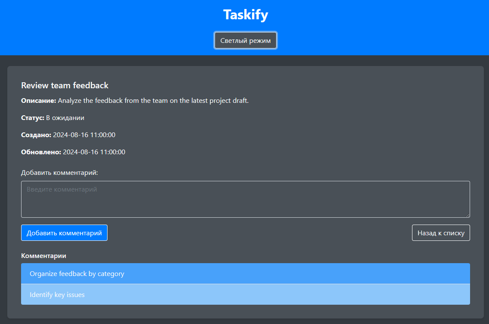
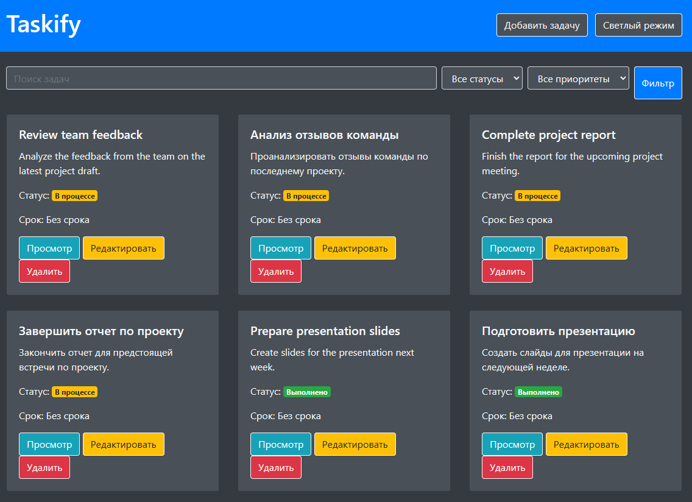

# Taskify на Fast API



## Описание web-приложения:
📋 Taskify — это веб-приложение для управления задачами, разработанное на FastAPI.

Оно предоставляет пользователям удобный интерфейс для создания, редактирования, просмотра и удаления задач.

Пользователи могут отслеживать состояние своих задач, добавлять комментарии и просматривать подробную информацию о каждой задаче.

Приложение использует современные технологии для обеспечения быстрой и надежной работы.

### 🖥️ Основные возможности:
1️⃣ Создание задач: Пользователи могут создавать новые задачи, указывая название, описание и статус.


2️⃣ Просмотр и редактирование задач: Возможность просматривать подробную информацию о задачах, а также редактировать их детали и статус.


3️⃣ Добавление комментариев: Встроенная форма позволяет пользователям добавлять комментарии к задачам для дополнительной информации и обсуждения.


4️⃣ Удаление задач: Пользователи могут удалять задачи, которые больше не актуальны.

5️⃣ Адаптивный дизайн: Интерфейс приложения адаптирован для различных устройств с использованием Bootstrap.



### 🛠 Стек технологий:
FastAPI: Современный фреймворк для создания высокопроизводительных API.

SQLAlchemy: ORM для взаимодействия с базой данных.

Bootstrap: CSS-фреймворк для создания адаптивных интерфейсов.

Jinja2: Шаблонизатор для генерации HTML-страниц на основе данных.

MongoDB/SQLite: База данных для хранения задач и комментариев (в зависимости от конфигурации).

### 📖 Структура проекта:
```
taskify/
│
├── main.py
├── database.py
├── models.py
├── schemas.py
├── update_db.py
├── tasks.json
├── requirements.txt
├── .gitignore
│
├── img/
│   ├── add_comments.png
│   ├── add_task.png
│   ├── black_taskify.png
│   ├── edit_task.png
│   └── white_taskify.png
│
├── static/
│   ├── style.css
│   └── script.js
│
└── templates/
    ├── index.html
    ├── add_task.html
    ├── edit_task.html
    └── view_task.html
```

```
Установка зависимостей:
pip install -r requirements.txt
```

```
** Если вы добавляете новые библиотеки в проект или обновляете их версии, обновите файл requirements.txt **

Обновление файла requirements.txt:
pip freeze > requirements.txt
```

### Установка:

**Клонируйте репозиторий:**

**cmd:** git clone https://github.com/ваш-репозиторий.git

### Запуск проекта:

**cmd:** uvicorn main:app --reload

**Если не работает на 8000 порту, то можно запустить на 8080 или 7000:**

**cmd:** python -m uvicorn main:app --port 8080

**cmd:** python -m uvicorn main:app --port 7000

### 🛡 Лицензия

Этот проект лицензирован под лицензией MIT. Подробности смотрите в файле LICENSE.

### 💡 Идеи для улучшений


#### 💼 Автор: Дуплей Максим Игоревич
#### 📲 Telegram: @QuadD4rv1n7
#### 📅 Дата: 16.08.2024 